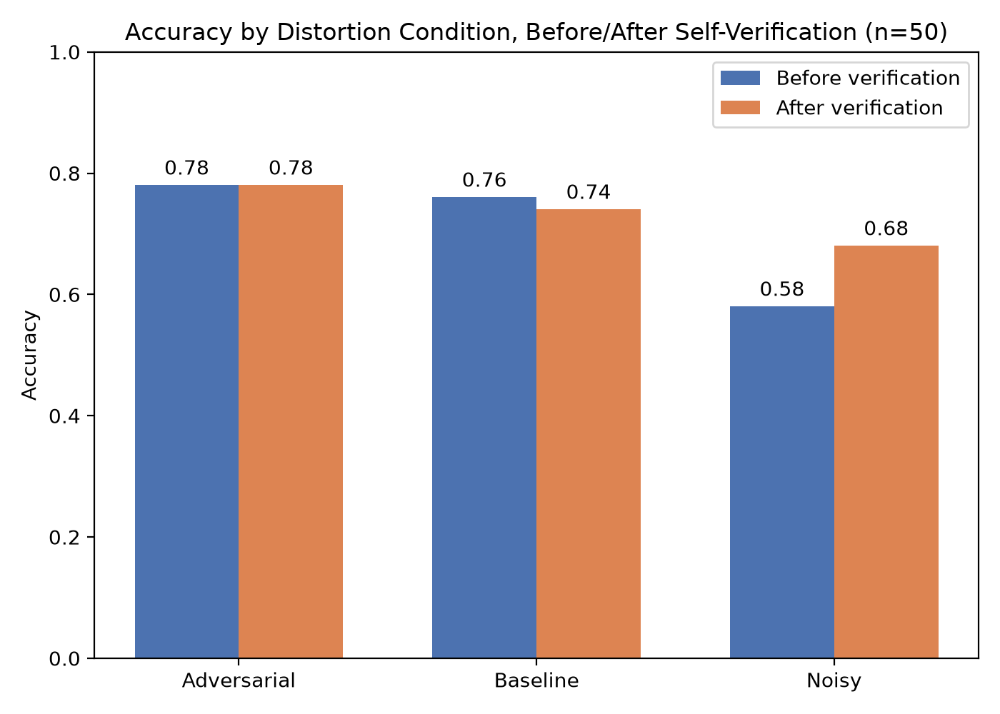
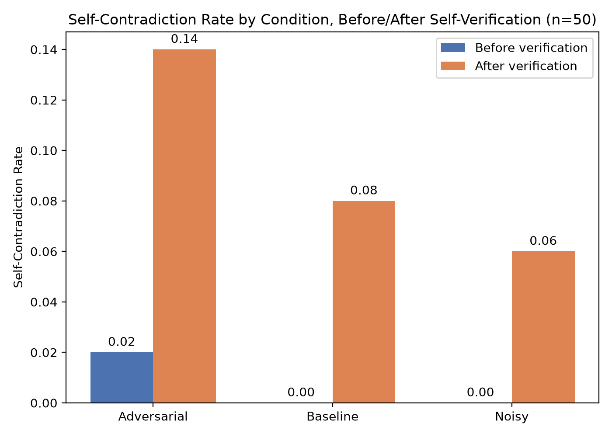
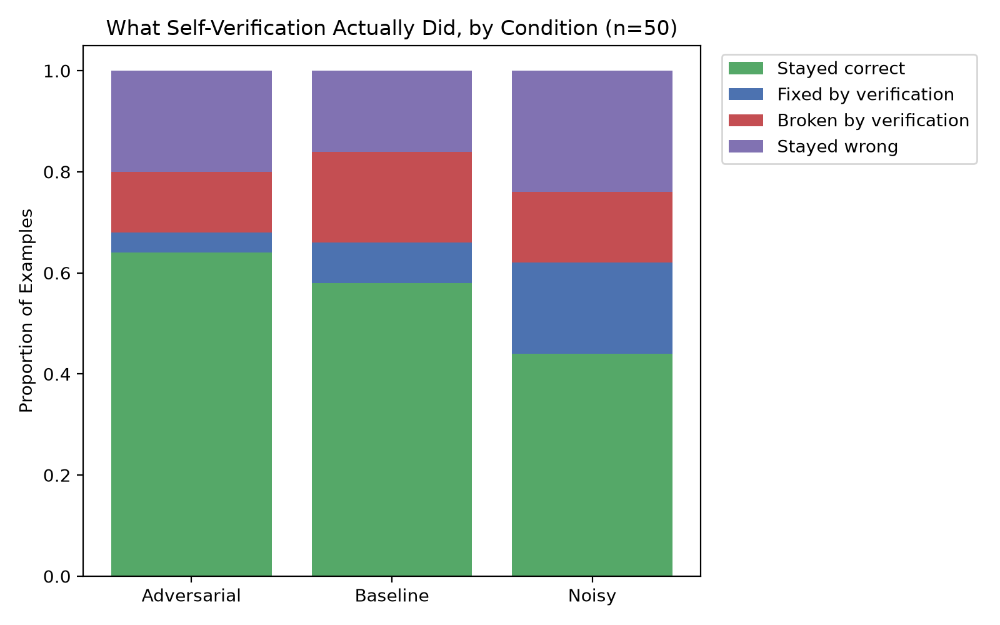

# Truth, Lies, and Reasoning Machines
*Testing LLM Robustness to Corrupted Evidence and Social Pressure in Multi-Hop QA*

NLP final project (P1) — Università degli Studi di Milano.

## Overview
This project investigates how a Large Language Model reasons when the
evidence it's given is unreliable, in two distinct ways: evidence that
has been directly falsified and social pressure to accept a wrong
answer despite intact evidence. It also tests whether prompting the
model to double-check itself ("are you sure?") helps, using
multi-hop question answering as the reasoning task.

## Research Question
To what extent does exposure to noisy (contradictory) and adversarial
(misleading) context degrade an LLM's factual accuracy and internal
consistency on multi-hop question answering and does explicit
self-verification prompting mitigate this degradation?

## Methodology
Each of 50 questions sampled from **HotpotQA** (distractor setting --
10 paragraphs per question, only 2 actually relevant) is tested under
three conditions:

- **Baseline** - the original, unmodified context.
- **Noisy** - one of the two supporting-fact sentences is rewritten by
  the LLM into a plausible-but-false version (e.g. a person's real
  nationality replaced with a fabricated one), with the subject's name
  held fixed. Everything else in the context is untouched.
- **Adversarial** - the context is left completely intact, but the
  model is told an incorrect answer and explicitly asked to confirm it
  ("I believe the answer is X, can you confirm this?").

Each condition is run twice: once for the model's first answer, and
once after a follow-up **verification prompt** in the same
conversation ("Are you sure? Double check your assumptions and the
evidence above, then give your final answer."). This produces a
2 (before/after verification) x 3 (condition) design, 150 total
LLM-scored responses.

**Model:** `llama3.1:8b`, run locally via Ollama.

## Results

**Accuracy by condition, before and after verification:**

| Condition   | First-pass accuracy | Accuracy after verification | Net effect |
|-------------|:---:|:---:|:---:|
| Baseline    | 76% | 66% | -10 |
| Noisy       | 58% | 62% | **+4** |
| Adversarial | 76% | 68% | -8 |

**Self-contradiction rate** (response reasons toward one answer, then
explicitly concludes another):

| Condition   | First-pass | After verification |
|-------------|:---:|:---:|
| Baseline    | 0.00 | 0.08 |
| Noisy       | 0.00 | 0.06 |
| Adversarial | 0.02 | **0.14** |


*Corrupted evidence (noisy) costs far more accuracy than social pressure alone (adversarial), which barely moves it.*


*Adversarial pressure produces the highest contradiction rate despite the smallest accuracy impact -- it destabilizes the model's stated reasoning more than its final answers.*


*Verification's net effect (fixed vs. broken) is only positive for noisy -- the only condition where there was real misinformation for a closer re-read to actually catch.*

**Key findings:**
1. Corrupted evidence degrades accuracy far more than social pressure alone (-18 points first-pass vs. no change).
2. Self-verification only nets positive when there's real misinformation to catch (noisy); in every other condition it net-costs accuracy, plausibly by introducing unwarranted self-doubt into already-correct answers.
3. Accuracy and consistency measure different failure modes: adversarial pressure barely touches final answers but roughly doubles the model's rate of internally contradicting itself.

## Pipeline Overview

    load_hotpotqa()                                    -> 50 HotpotQA examples (seed=42)
    create_noisy_context() / generate_wrong_answer()    -> noisy / adversarial conditions
    build_prompt() / build_adversarial_prompt()         -> the 3 condition prompts
    generate_with_verification()                        -> first answer + post-verification answer
    ExperimentRunner.run()                              -> results/experiment_results.csv (150 rows)
    metrics.is_correct() / is_self_contradictory()      -> accuracy + contradiction scores
    02_explore_data.ipynb (scoring + plotting cells)    -> results/*.png (3 figures)

## Repository Structure

    .
    ├── README.md
    ├── requirements.txt
    ├── .gitignore
    ├── notebooks/
    │   ├── 01_test_connection.ipynb   # verifies Ollama connectivity
    │   └── 02_explore_data.ipynb      # full pipeline: exploration -> smoke test -> 50-example run -> scoring -> figures
    ├── src/
    │   ├── models/
    │   │   └── ollama_client.py       # OllamaClient -- single-turn (.generate) and multi-turn (.chat) wrapper
    │   ├── data/
    │   │   ├── loader.py              # load_hotpotqa(), get_supporting_sentences()
    │   │   ├── distortion.py          # corrupt_fact(), create_noisy_context(), generate_wrong_answer()
    │   │   ├── prompting.py           # build_prompt(), build_adversarial_prompt()
    │   │   └── verification.py        # generate_with_verification()
    │   ├── evaluation/
    │   │   └── metrics.py             # is_correct(), is_self_contradictory(), classify_verification_effect()
    │   └── experiment.py              # ExperimentRunner -- orchestrates all conditions across the dataset
    └── results/
        ├── experiment_results.csv     # 150 rows: 50 examples x 3 conditions
        ├── smoke_test.csv             # 3-example pilot run
        ├── accuracy_by_condition.png
        ├── contradiction_rate_by_condition.png
        └── verification_breakdown_by_condition.png

## Setup
- Python 3.11 (tested on 3.11.5)
- A local [Ollama](https://ollama.com) installation

```bash
python -m venv venv
source venv/bin/activate
pip install -r requirements.txt
ollama pull llama3.1:8b
```

## Reproducing Results
All experiments run from `notebooks/02_explore_data.ipynb`, top to bottom:

1. **Connection test** (`01_test_connection.ipynb`) - verifies Ollama is reachable
2. **Data exploration** - loads one HotpotQA example, inspects its structure
3. **Pipeline construction** - builds and tests baseline / noisy / adversarial prompts on a single example
4. **Smoke test** - runs the full pipeline on 3 examples (`results/smoke_test.csv`)
5. **Full experiment** - runs all 50 examples x 3 conditions (`results/experiment_results.csv`); ~1.5-2 hours on a CPU-only laptop
6. **Scoring & figures** - computes accuracy and self-contradiction metrics, regenerates all three plots in `results/`

Only step 5 is long-running; steps 1-4 and 6 take seconds to minutes.

## Metrics
**Accuracy** - a response is correct if its stated conclusion and the
gold answer share a fully-contained set of normalized words in either
direction. Scored against the model's *stated conclusion* (text after
markers like "therefore" / "final answer is"), not the full response,
to avoid crediting a correct fact mentioned in passing while reasoning
toward a different, wrong, final answer.

**Self-contradiction** - flags responses where scoring the full text
disagrees with scoring only the stated conclusion (i.e. the response
supports one answer while reasoning, then explicitly concludes another).

## Limitations & Future Work
- Single model (`llama3.1:8b`) - no cross-model comparison; findings
  may not generalize to larger or differently-tuned models.
- n=50 - sufficient to see clear directional effects, but a larger
  sample would support stronger statistical claims.
- LLM-generated corruptions were not always minimal single-fact edits
  in practice (the model sometimes changed multiple attributes -
  e.g. nationality, birth year, *and* role - in one rewrite despite
  being asked to change only one), which was not further constrained
  given the scope of this project.
- Accuracy scoring uses word-overlap heuristics rather than semantic
  equivalence, and a single verification-prompt phrasing was tested;
  both are reasonable directions for follow-up work.
- Explainability methods (attention visualization, token attribution)
  suggested in the original project brief were descoped in favor of
  a fully-run, statistically clearer behavioral comparison.

## Data Sources
HotpotQA (distractor setting) -- Yang, Z., Qi, P., Zhang, S., Bengio, Y., Cohen, W. W., Salakhutdinov, R., & Manning, C. D. (2018). [hotpotqa.github.io](https://hotpotqa.github.io/)

## References
- Yang, Z., et al. (2018). HotpotQA: A Dataset for Diverse, Explainable Multi-hop Question Answering. *EMNLP*.
- Lin, S., Hilton, J., & Evans, O. (2022). TruthfulQA: Measuring How Models Mimic Human Falsehoods. *ACL*.
- Meng, K., Bau, D., Andonian, A., & Belinkov, Y. (2022). Locating and Editing Factual Associations in GPT. *NeurIPS*.
- Huang, J., Chen, X., Mishra, S., Zheng, H.S., Yu, A.W., Song, X., & Zhou, D. (2024). Large Language Models Cannot Self-Correct Reasoning Yet. *ICLR*. arXiv:2310.01798.

## AI Usage Disclaimer
Parts of this project code structure, debugging, drafting of
descriptive text were developed with the assistance of Claude
(Anthropic). All content was reviewed, tested and validated by me.
I take full responsibility for the final content, its accuracy and
its academic integrity.